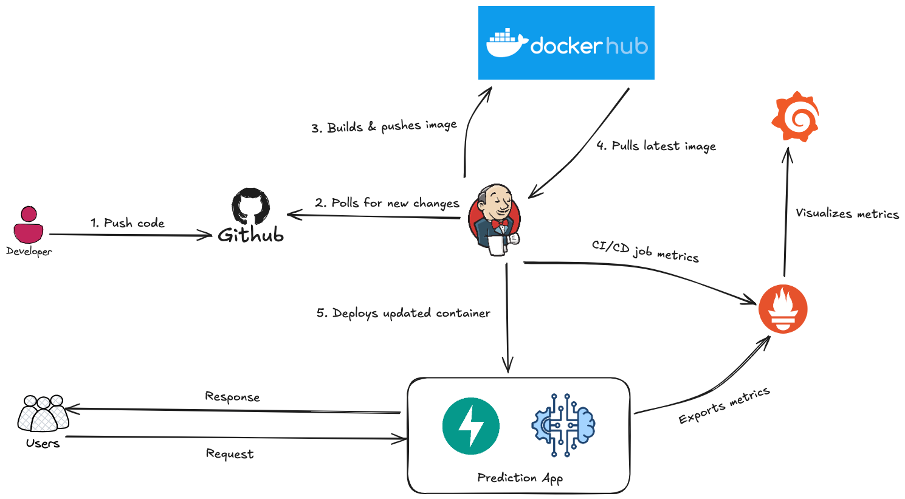

# Simple CI/CD Pipelines

## Overview
A minimal **CI/CD setup** for deploying a **FastAPI ML prediction service** using **Jenkins**, **Docker**, and **Prometheus/Grafana** — no Kubernetes required.

For production-grade setups, you can extend this with Helm Charts and Kubernetes clusters.



---

## Prerequisites
- **Docker**
- **kubectl**
- **Kind**
- **Terraform**

---

## Stack
- **Version Control:** Git / GitHub (supports webhook integration).
- **CI/CD:** Jenkins.
- **App:** FastAPI (ML Prediction Service).
- **Containerization:** Docker.
- **Monitoring:** Prometheus + Grafana.

---

## Repository Structure
```txt
CI-CD-pipeline-with-Jenkins
├── prediction-app
│   ├── main.py
│   ├── schema.py
│   ├── models/model.pkl
│   └── utils/
│       ├── data_processing.py
│       └── logging.py
├── jenkins/
│   ├── init.groovy.d/
│   │   ├── 01-seed-job.groovy
│   │   ├── auto-run.groovy
│   ├── pipelines/
│   │   ├── connection-test.Jenkinsfile
│   │   ├── build-app.Jenkinsfile
│   │   └── deploy-app.Jenkinsfile
│   ├── .env
│   ├── Dockerfile
│   ├── plugins.txt
│   └── jenkins.yaml
├── prometheus/
│   └── prometheus.yml
├── grafana/
│   └── provisioning/datasources/prometheus.yml
├── docker-compose.yaml
├── Dockerfile
├── requirements.txt
└── README.md
```

---

## Setup & Run

### Configure Jenkins

Edit `jenkins/.env`:
  - Add your GitHub username, token, and repository URL.
  - Add DockerHub credentials.

### Start Services

```bash
docker-compose up -d --build
```

---

## Pipeline Logic

- `connection-test` → verifies GitHub & DockerHub credentials.
- `build-app` → clones repo, builds Docker image, pushes to DockerHub.
- `deploy-app` → auto-triggers after `build-app` success; runs container on host.

Jenkins automatically runs all three pipelines sequentially on the first startup.

---

## Github Webhook Setup (Optional)

### Step 1

Expose Jenkins using `ngrok`. Use GitHub Webhook instead of polling:
```bash
ngrok http 8080
```

### Step 2
Add the ngrok URL as a Webhook in your GitHub repo (Settings → Webhooks).

---

## Monitoring
Prometheus scrapes metrics from prediction-app (/metrics) and itself, and Grafana visualizes them automatically via provisioned dashboards.

---

### Author
__Maintained by Quoc Nguyen__
- GitHub: [@quocnguyenx43](https://github.com/quocnguyenx43/)
- LinkedIn: [@quocnguyenx43](https://www.linkedin.com/in/quocnguyenx43/)
- Email: [quocnguyenx43@gmail.com](mailto:{quocnguyenx43@gmail.com})
